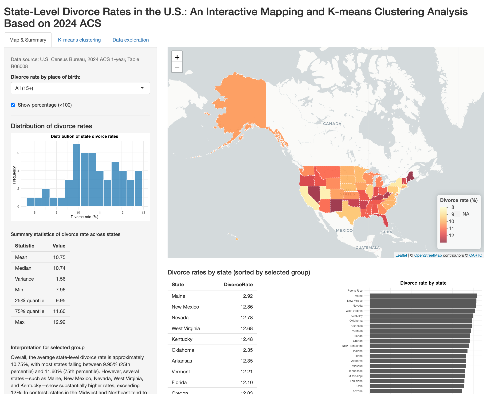

# U.S. Divorce Patterns: Birth-Origin Rates, Socioeconomic Factors, and K-means Clustering
> Analysis based on 2024 ACS one-year estimates  
> Includes Shiny App, clustering, PCA, and geographic visualization

Shiapp url is here: https://kenziewcm.shinyapps.io/divorce-app/
---

  

## 📌 Project Overview

This project examines variation in U.S. state-level divorce rates using **2024 ACS data**, with divorce rates broken down by **birth-origin groups**:

- Native-born residents  
- Residents born in other U.S. states  
- U.S. citizens born abroad  
- Foreign-born residents  

We integrate these rates with socioeconomic indicators—including income, poverty, unemployment, education, migration, and housing—and apply **K-means clustering** and **PCA** to uncover structural regional patterns.  

An interactive **Shiny app** provides geographic visualizations, exploratory summaries, and cluster-based mapping.

---

## 🔍 Key Findings

### **1️⃣ Divorce rates differ substantially across birth-origin groups**
- Native-born: **9–11%**, relatively stable  
- Other-state migrants: **10–14%**, more dispersed  
- U.S.-born abroad: widest range **6–20%+**, highly volatile  
- Foreign-born: lowest rates **7–9%**

Regional hotspots include several southern and Mountain West states.

---

### **2️⃣ Socioeconomic indicators strongly correlate with divorce**
- **Higher poverty & unemployment → higher divorce**  
- **Higher median income & education → lower divorce**  
- Housing and migration variables show moderate or weaker associations

Economic disadvantage appears structurally linked to marital instability.

---

### **3️⃣ K-means clustering identifies three distinct U.S. regional profiles**

#### **Cluster 1 — Low Divorce, High Socioeconomic Advantage**
States like CA, NY, MA, CO, WA, NJ  
- High income & education  
- Low poverty  
- Lowest divorce across all birth groups  

#### **Cluster 2 — High Divorce, High Economic Stress**
States like NM, WV, KY, AL, MS, LA  
- High poverty & unemployment  
- Low education  
- Highest divorce rates overall  

#### **Cluster 3 — Moderate Divorce, Mixed Profile**
States like ME, VT, OR, IN, MO, GA  
- Middle-range economic conditions  
- Moderate divorce rates  
- Regionally diverse

PCA confirms clean separation of the three clusters.

---

## 🗺️ Interactive Shiny App

👉 **https://kenziewcm.shinyapps.io/divorce-app/**

Features:

- State-level choropleth divorce maps  
- Birth-origin group comparisons  
- Histograms & summary statistics  
- PCA visualization  
- Cluster mapping & profiles

---

## 🧠 Methods

### **Data Construction**
- ACS Table **B06008**: Divorce by place of birth  
- Additional indicators merged from ACS:
  - Poverty rate  
  - Median household income  
  - Unemployment rate  
  - College attainment  
  - Foreign-born share  
  - Median age  
  - Housing (rent, home value, owner-occupied rate)

### **Preprocessing for Clustering**
- Removed NA/Inf and unstable denominators  
- Standardized all variables (z-score)  
- Removed zero-variance features  
- Used `nstart = 25` for stable K-means optimization

### **Model Selection**
- Elbow method → **k = 3**  
- PCA used for visualization, not model fitting

---

## 🧭 Interpretation & Implications

- Divorce patterns reflect deeper **structural socioeconomic differences**.  
- Economic stress is closely associated with high divorce rates.  
- Birth-origin analysis reveals hidden heterogeneity across demographic subgroups.  
- The combination of clustering + spatial mapping offers a useful framework for understanding regional marital stability.

---

## ⚠️ Limitations

- ACS 1-year estimates include sampling noise for small subgroups  
- U.S.-born-abroad divorce rates may fluctuate due to small denominators  
- K-means assumes spherical clusters  
- All results are **descriptive**, not causal  
- Additional demographic/cultural factors (religion, occupational structure) not included

---

## 🔮 Future Directions

- Extend analysis to multi-year ACS for trend evaluation  
- Explore nonlinear or density-based clustering (DBSCAN, GMM)  
- Add predictive modeling for divorce patterns  
- Validate clusters using external sociological or regional typologies  

